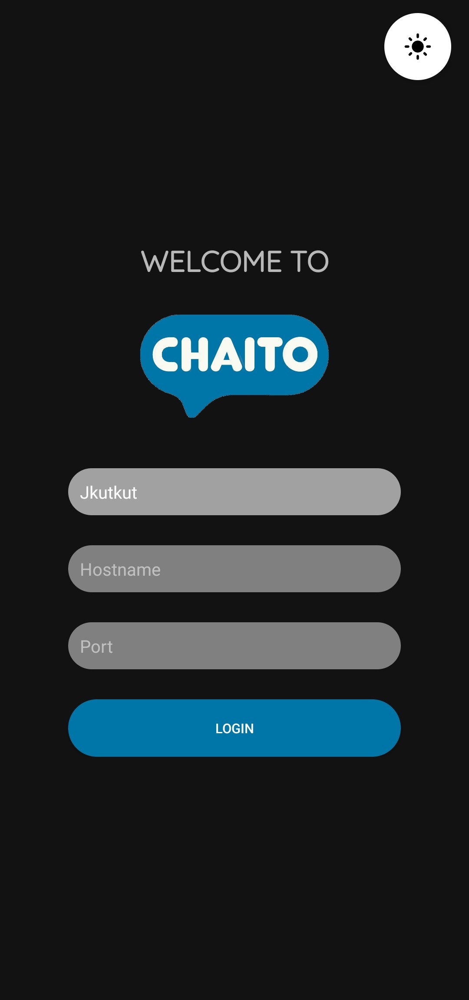
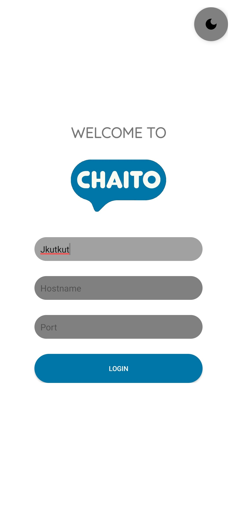
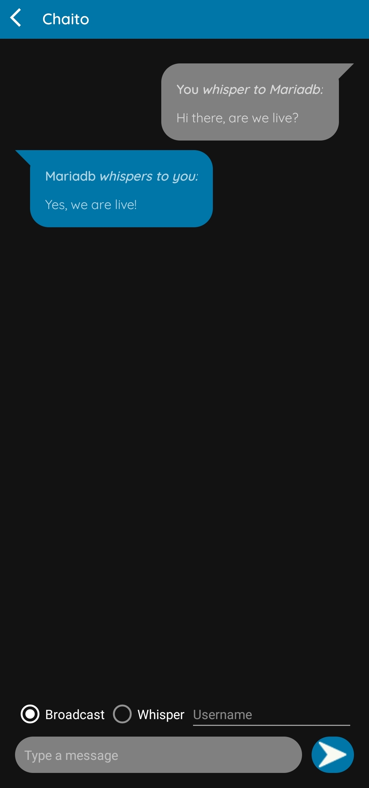
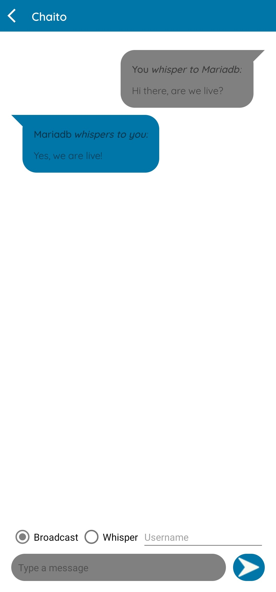

# Chaito:

Chaito is a simple, lightweight and fast chat application written in Java. With an Android client and a dockerized server, it's easy to setup and use.

## Features:
- [x] Android client.
- [x] Server that can be run as a Docker container.
- [x] SQLite database to store messages.
- [x] Custom communication protocol.
- [x] Communication to all users and whispering to a specific one.
- [x] Light and dark modes.

## Server:
1. Clone the repository.
```bash
git clone git@github.com:Jkutkut/Chaito.git
```
2. Go to the server directory.
```bash
cd Chaito/server
```
3. Run the `run.sh` script.
```bash
./run.sh
```

## Client:
1. Clone the repository.
```bash
git clone git@github.com:Jkutkut/Chaito.git
```
2. Open the `app` directory in Android Studio.
3. Run the app on your device.
4. Select the server IP and port.
5. Select a username.
6. Enjoy!

|||
|:--:|:--:|
|||
|||